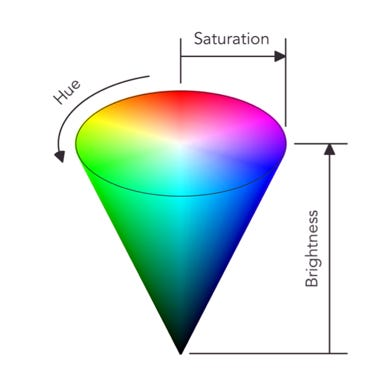
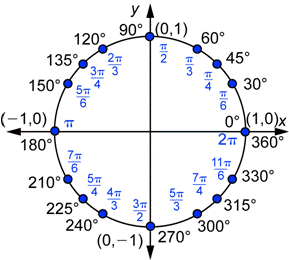
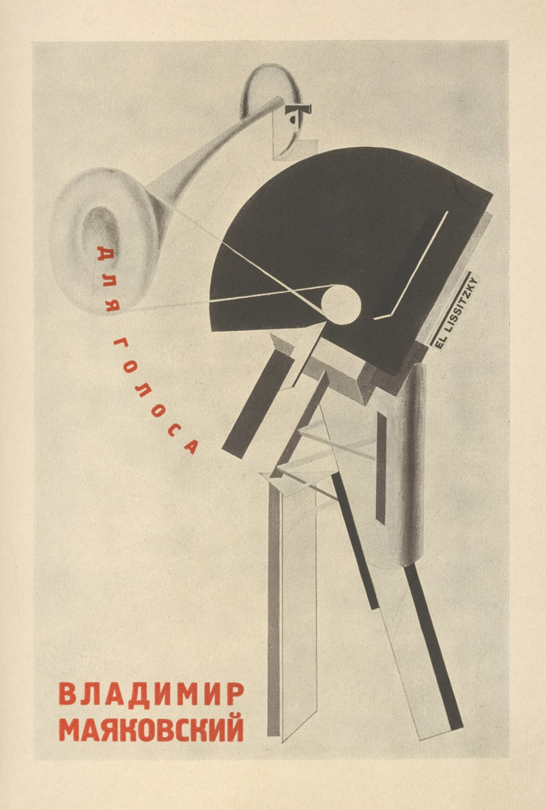

# Clase 06 - 9 septiembre

hoy no hay evaluación, vamos a repasar

TODO subir lo que se hizo en clase

## Intro de la clase

podemos entrar al botón de "raw" de cualquier bitácora. Por ejemplo, el README.md de [Nicole Renata](https://github.com/nicolerenata01/Bitacora-electronica-digital-S2-2026/blob/main/README.md)

<https://raw.githubusercontent.com/nicolerenata01/Bitacora-electronica-digital-S2-2026/refs/heads/main/README.md>

Aprenderemos a trabajar con modo de color HSB a través de `colorMode(HSB,360,100,100,100);`

## Estructuras de código nuevas

Aprendimos a usar la estructura `rect();` para dibujar rectángulos según la referencia <https://processing.org/reference/rect_.html>

Usamos `pushMatrix();` y `popMatrix();` para manipular el eje de coordenadas, y dibujar las primitivas siempre en `(0,0)` por medio de `translate(x,y)`. 

También podemos rotar figuras luego de haber movido el eje de coordenadas con `rotate(anguloEnRadianes);`. Para evitar la confusión podemos además usar la función `radians(anguloEnGrados)` dentro de el argumento de rotate:

`rotate(radians(anguloEnGrados));`

Aprendimos a usar el operador módulo `%`. Una de sus aplicaciones se encuentra en como se construye el dígito verificador del [RUT](https://es.wikipedia.org/wiki/Rol_%C3%9Anico_Tributario). 

Usar variables es la principal potencia de la programación. Utilizar estructuras de tipo función para administrar argumentos me permitiría por ejemplo, jugar pokemon a través de peces: <https://arstechnica.com/gaming/2014/08/an-actual-fish-has-been-playing-pokemon-red-for-135-hours-now/>. La posición del pez es guardada en una variable, y esa variable es usada en controlar el joystick virtual.

## Otros

Vimos un proyecto que realicé en la residencia para crear kits de poesía magnética e implementarlo en una página web: <https://github.com/misaaaaaa/code-switching-poetry>

Película recomendada: Código Enigma

¿Por qué los primeros computadores fueron hechos con ampolletas? <https://www.youtube.com/watch?v=FU_YFpfDqqA>

## Info Entrega

Construir un afiche en clave Constructivismo ruso (figuras primitivas + texto) que incluya una cita con referencia (un haiku, poema, libro, película, etc) o una escritura propia.

Incluir algún elemento que se mueva con el tiempo. Puede ser a través de `frameCount` o por medio de `mouseX`, `mouseY`, u otras estructuras que conozcan.

Matrosam (1923) - El Lissitzky

## Registro de video

<https://youtu.be/ZjaHaX9ry0I>
