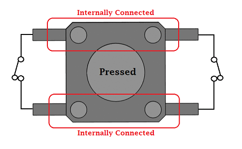
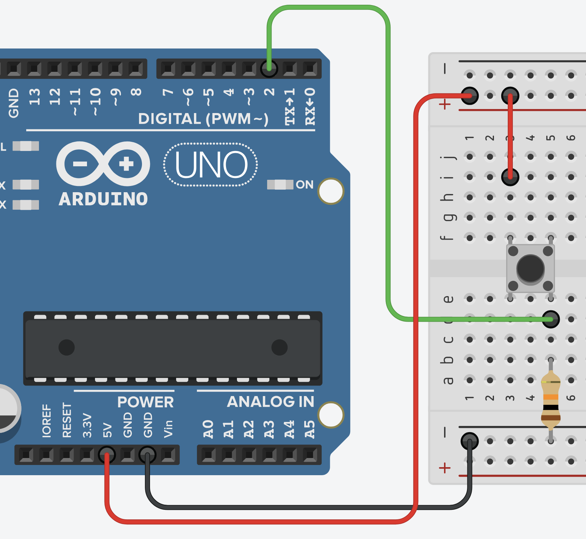
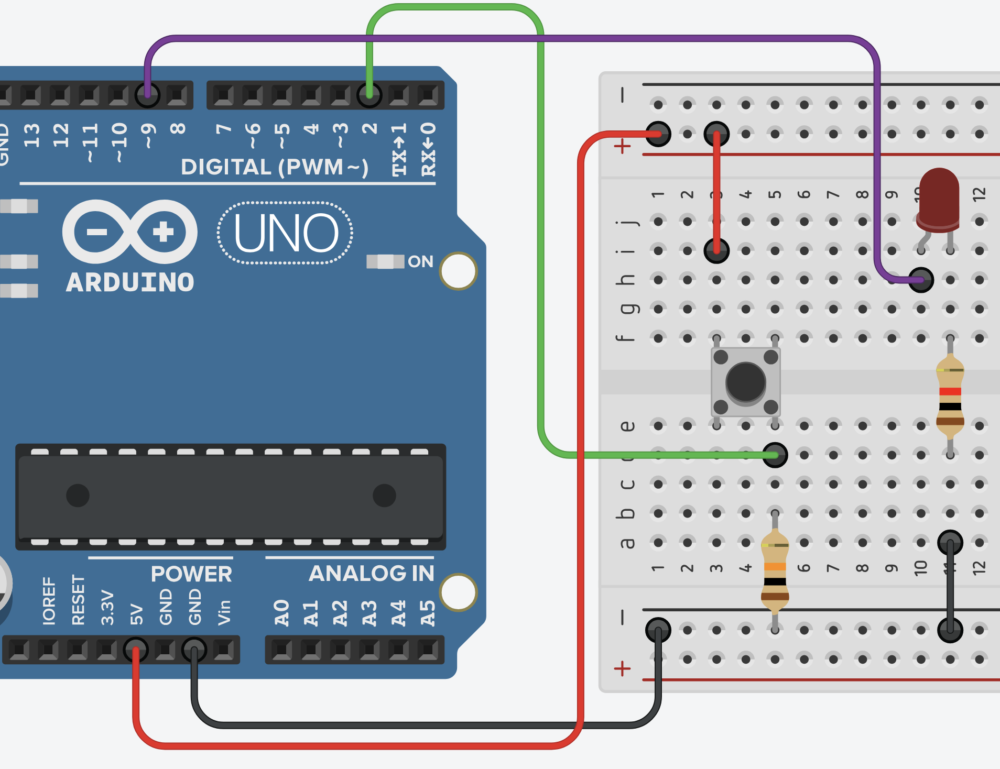

# Clase 08 - 30 septiembre

aprendimos a usar un botón

para el código [miPrimerBoton.ino](./miPrimerBoton.ino) usamos el siguiente esquema, donde prendemos el led interno del arduino. también aprendimos a negarlo, que sea el comportamiento opuesto [miPrimerBotonNegado.ino](./miPrimerBotonNegado.ino)

luego incorporamos un led en la pata 9

y aprendimos sobre escribir análogo en [botonRandomIF.ino](./botonRandomIF.ino)

## Encargo

implementar que la lectura del LDR depende de si hay un botón apretado (al apretar el botón se entre en modo calibración de intensidad)