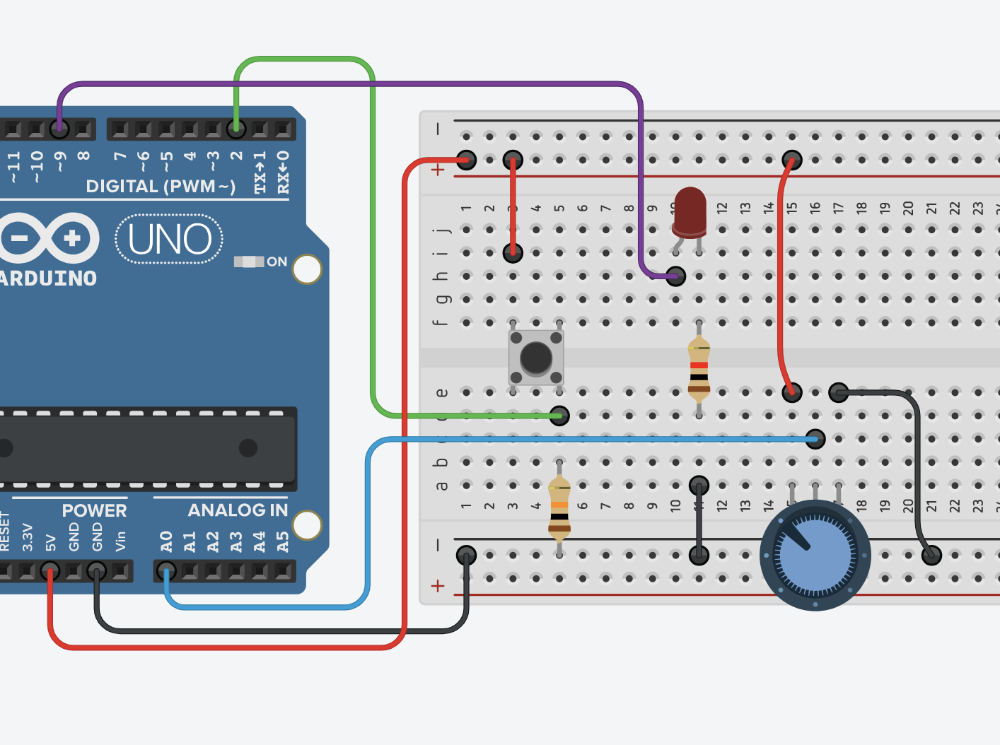
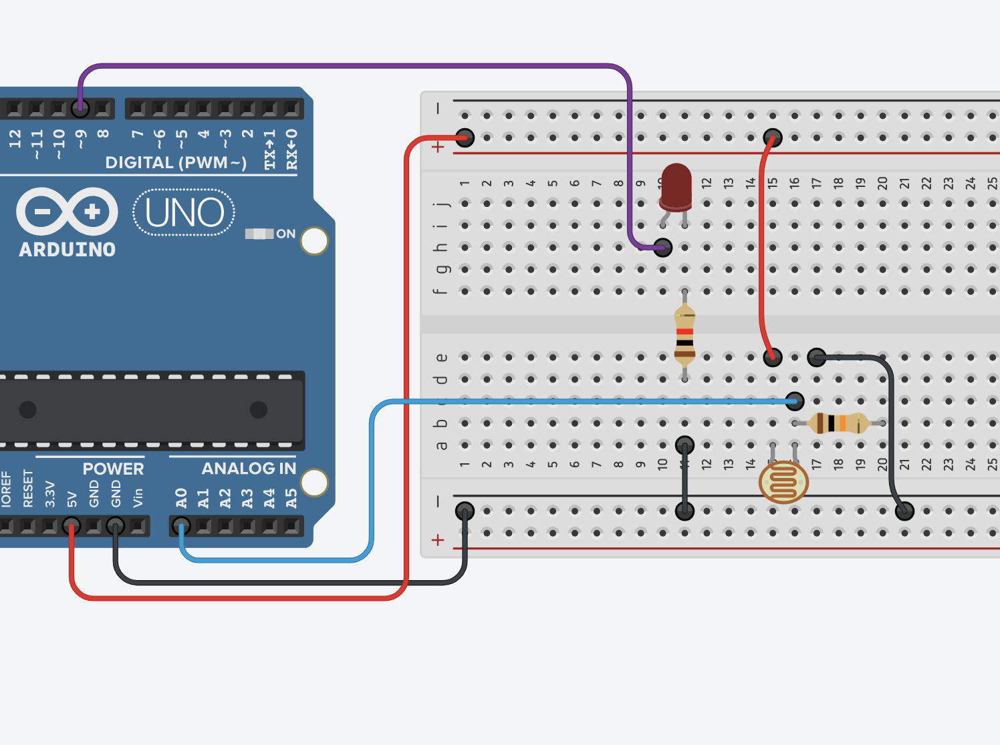

# Clase 08 - 30 septiembre

aprendimos a usar un botón. Este botón se llama SPST. Ocupa 4 patitas por tema de estabilidad mecánica, pero en realidad se comporta eléctricamente como si tuviera solo 2. 


para el código [miPrimerBoton.ino](./miPrimerBoton.ino) usamos el siguiente esquema, donde prendemos el led interno (pin13) del arduino. también aprendimos a negarlo, que sea el comportamiento opuesto [miPrimerBotonNegado.ino](./miPrimerBotonNegado.ino)

TUTORIAL ONLINE: este ocupa un delay después de cada lectura <https://edgarpons.com/botones-en-arduino-y-comandos-if-else/>

con esto ya sabemos usar entradas y salidas DIGITALES (números que solo pueden ser 0 o 1):

```arduino
// Para entradas guardamos en variables (de tipo bool es suficiente)
variable = digitalRead(botonPin)

//para salidas le decimos directamente donde y qué estado escribiremos
digitalWrite(ledPin, estado)
```

luego incorporamos un led en la pata 9, y cambiamos en el código `int ledPin = 9;` a que fuera para ese pin en vez del 13.


## Sobre análogo y digital

acá hay un breve tutorial para distinguir entre ambas <https://www.youtube.com/watch?v=j8E9OSt8Xek>

y aprendimos sobre escribir análogo (valores "grises"), o valores entre 0 y 255 (en 8 bit) en [botonRandomIF.ino](./botonRandomIF.ino). Cada vez que pulsamos el botón, el led cambia de brillo a una intensidad distinta. Para esto debimos usar:

```arduino
// acá podemos escribir valores enteros entre 0 y 255
analogWrite(ledPin, valor)
```

OJO: En arduino solo se pueden escribir valores analógicos en los pines que tienen una virgulilla (~) al lado del pin, como las que se encuentran en 3, 5, 6, 9, 10 y 11

la teoría de como Arduino (un microcontrolador digital) logra escribir valores analógicos no la pasé, pero si quieren averiguar un poco sobre eso pueden revisar acá <https://programarfacil.com/blog/arduino-blog/pwm-con-arduino-analogico/>

## Uso de potenciómetro

luego aprendimos a usar ENTRADAS analógicas con los pines de A0 - A5 de un potenciómetro, que es lo mismo que una resistencia variable 

```arduino
int valorPot; // creamos la variable donde guardamos el valor del pot

// en el loop actualizamos ese valor
void loop(){

    valorPot = analogRead(potPin)
}

```

se conecta de esta manera:



este tutorial hace algo similar, usando algo llamado `Serial.begin(9600);` que aprenderemos a usar la próxima clase: <https://eloctavobit.com/lenguaje-programacion-para-arduino/analogread>

en nuestra implementación, tuvimos que dividir por 4 el valor de la entrada, ya que estaba en un rango entre 0 y 1023, y la salida está de 0 a 255

finalmente, reemplazamos el potenciómetro por una resistencia dependiente de la luz (LDR), con ayuda de una resistencia de referencia de 10k



en nuestra implementación de [ldr-led-invertido.ino](./ldr-led-invertido.ino) logramos hacer que al bajar la luz, se prendiera más el led

en la implementación de este ejemplo, se usa la variación de la luz ambiente para prender la luz, según un umbral <https://programarfacil.com/blog/arduino-blog/ldr-arduino/>

## Encargo

implementar que la lectura del LDR depende de si hay un botón apretado (al apretar el botón se entre en modo calibración de intensidad). Si no hay botón apretado, la intensidad de la luz no se ve afectada por la lectura del LDR

y como se perdió la grabación de este día, junten preguntas para la próxima clase