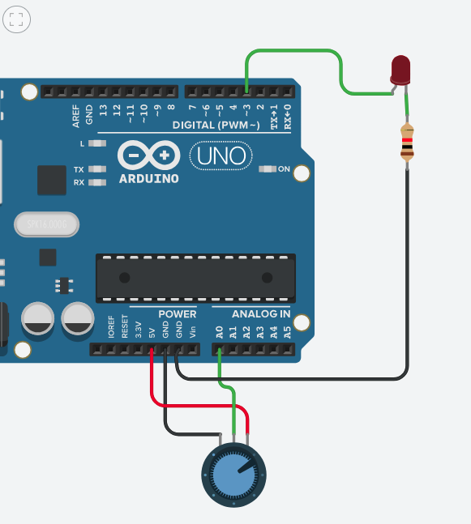

# Clase 09 - 7 octubre

lo importante es que queremos

>sentir el mundo
>
>guardar esa sensación en una variable
>
>usar esa variable
>
>actuar en el mundo

la semana pasada lo hicimos con un potenciómetro y un LDR, para controlar el brillo de un LED

## diferencia analogo y digital en arduino

|         | in                                                                                                                           | out                                                                                                                                            |
|---------|------------------------------------------------------------------------------------------------------------------------------|------------------------------------------------------------------------------------------------------------------------------------------------|
| analog  | analogRead(numeroPinA); por ejemplo: potenciometro, LDR   valores posible: 0 - 1023  funcionan en pines analog in (A0 al A5) | analogWrite(numeroPin, valor); leds con intensidad intermedia  valor posible: 0 - 255  funcionan en CIERTOS pines digitales (~): 3,5,6,9,10,11 |
| digital | digitalRead(númeroPin); por ejemplo: botones   funcionan en pines digitales (Del 0 al 13)                                    | digitalWrite(numeroPin, variable); por ejemplo: luces on/off  funcionan en pines digitales (Del 0 al 13)                                       |

En el fondo, todo esto, son sistema de comunicación. Hay otros sistemas de comunicación que puede usar arduino, como un PROTOCOLO llamado I2C

## diagrama wokwi potenciometro led

puedes copiar y pegar este código en la sección "diagram.json" de tu proyecto de wokwi

se debería ver así



```json
{
  "version": 1,
  "author": "Matías Serrano",
  "editor": "wokwi",
  "parts": [
    { "type": "wokwi-arduino-uno", "id": "uno", "top": -95.4, "left": -67.8, "attrs": {} },
    {
      "type": "wokwi-potentiometer",
      "id": "pot1",
      "top": 165.3,
      "left": 125.8,
      "rotate": 180,
      "attrs": {}
    },
    {
      "type": "wokwi-led",
      "id": "led1",
      "top": -166.8,
      "left": 128.6,
      "attrs": { "color": "magenta", "flip": "1" }
    },
    {
      "type": "wokwi-resistor",
      "id": "r1",
      "top": -130.45,
      "left": 163.2,
      "attrs": { "value": "1000" }
    }
  ],
  "connections": [
    [ "pot1:VCC", "uno:5V", "red", [ "v-48", "h-56.8" ] ],
    [ "uno:GND.3", "pot1:GND", "black", [ "v57.5", "h61.6" ] ],
    [ "pot1:SIG", "uno:A0", "green", [ "v-67.2", "h-18.8" ] ],
    [ "led1:C", "r1:1", "green", [ "v0" ] ],
    [ "r1:2", "uno:GND.2", "black", [ "v240", "h-116.4" ] ],
    [ "led1:A", "uno:3", "green", [ "v19.2", "h10" ] ]
  ],
  "dependencies": {}
}
```

## diagrama wokwi potenciometro pantalla

```json 
{
  "version": 1,
  "author": "Matías Serrano",
  "editor": "wokwi",
  "parts": [
    { "type": "wokwi-breadboard-half", "id": "bb1", "top": 237, "left": 41.2, "attrs": {} },
    { "type": "wokwi-arduino-uno", "id": "uno", "top": -37.8, "left": -39, "attrs": {} },
    {
      "type": "wokwi-potentiometer",
      "id": "pot1",
      "top": 405.3,
      "left": 97,
      "rotate": 180,
      "attrs": {}
    },
    {
      "type": "board-ssd1306",
      "id": "oled1",
      "top": 291.14,
      "left": 403.43,
      "attrs": { "i2cAddress": "0x3c" }
    }
  ],
  "connections": [
    [ "uno:5V", "bb1:tp.1", "red", [ "v47.9", "h-101.8", "v48" ] ],
    [ "uno:GND.2", "bb1:bn.1", "black", [ "v76.7", "h-120.9", "v201.6" ] ],
    [ "pot1:VCC", "bb1:tp.5", "red", [ "v0" ] ],
    [ "pot1:GND", "bb1:bn.11", "black", [ "v-9.6", "h38.4" ] ],
    [ "pot1:SIG", "uno:A0", "green", [ "v-192", "h29.2" ] ],
    [ "oled1:GND", "bb1:bn.25", "black", [ "v-19.2", "h-57.6", "v153.6" ] ],
    [ "oled1:VCC", "bb1:tp.25", "red", [ "v0" ] ],
    [ "oled1:SCL", "uno:A5", "purple", [ "v-124.8", "h-239.7" ] ],
    [ "oled1:SDA", "uno:A4", "blue", [ "v-105.6", "h-259.13" ] ]
  ],
  "dependencies": {}
}
```

## links relevantes

conversor de imágenes para pantalla <https://javl.github.io/image2cpp/>

biblioteca ssd1306 de adafruit <https://github.com/adafruit/adafruit_ssd1306>

pantalla afel <https://afel.cl/products/pantalla-lcd-oled-azul-y-amarillo-0-96>

## códigos en clase

[miPrimerSerialPrint.ino](./miPrimerSerialPrint.ino)

[mi primera pantalla](./miPrimeraPantalla-096.ino)

[pantalla-potenciometro](./pantalla-potenciometro.ino)

[pantalla-bob.ino](./pantalla-bob.ino)

proyecto de bob: [./bob-pantalla](./bob-pantalla/)

royecto de bob post claude: [./bob-pantalla-claudeado](./bob-pantalla-claudeado/)

## grabación clase

<https://youtu.be/R1j5wIGl8pA>
